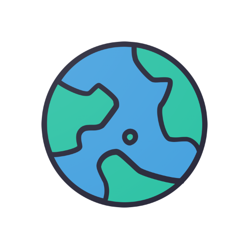

# DaiDay - Daily Mood & Activity Tracker

<div align="center">
  
  
  <p><strong>Track your moods, log your activities, and visualize your emotional journey</strong></p>
  
  [](https://flutter.dev)
  [](https://dart.dev)
  [](LICENSE)
</div>

---

## 📱 About

**DaiDay** is a comprehensive mood and activity tracking mobile application built with Flutter. It helps users maintain awareness of their emotional well-being by logging daily moods, activities, and notes. With beautiful visualizations and an intuitive interface, DaiDay makes self-reflection easy and insightful.

### ✨ Key Features

- 🎭 **Mood Tracking** - Log your emotional state with 9 different mood options (Cheerful, Happy, Good, Cool, Meh, Bad, Sad, Stressed, Awful)
- 📝 **Activity Logging** - Track daily activities with emoji-based categorization (17+ predefined activities)
- 📅 **Calendar View** - Visualize your mood history on an interactive calendar
- 📊 **Statistics & Charts** - Analyze mood patterns with beautiful bar and pie charts
- 🔍 **Search Functionality** - Quickly find past entries by searching through notes
- 🌓 **Dark Mode** - Eye-friendly dark theme support
- 👤 **Personalization** - Customize your profile with a personal name
- 🎨 **Beautiful UI** - Modern gradient-based mood cards with smooth animations
- 💾 **Offline Storage** - All data stored locally using Hive database

---

## 🏗️ Architecture & Tech Stack

### **Core Technologies**

| Technology | Purpose |
|------------|---------|
| **Flutter** | Cross-platform mobile framework |
| **Dart** | Programming language (SDK >=2.12.0 <3.0.0) |
| **BLoC Pattern** | State management (flutter_bloc ^7.0.0) |
| **Hive** | Local NoSQL database (^2.0.4) |
| **GetIt** | Service locator for dependency injection (^6.1.1) |

### **Key Dependencies**

```yaml
# State Management
flutter_bloc: ^7.0.0
rxdart: ^0.26.0
provider: ^5.0.0

# Local Storage
hive: ^2.0.4
hive_flutter: ^1.0.0
path_provider: ^2.0.1

# UI Components
responsive_navigation_bar: ^2.1.1
table_calendar: ^3.0.1
charts_flutter: ^0.11.0
introduction_screen: ^2.1.0

# Development
hive_generator: ^1.1.0
build_runner: ^2.0.1
flutter_launcher_icons: ^0.9.1
```

---

## 📂 Project Structure

```
daiday/
├── lib/
│   ├── screens/
│   │   ├── mainPage/          # Home screen with mood log list
│   │   ├── addPage/            # Mood & activity selection
│   │   ├── calendarPage/       # Calendar view of moods
│   │   ├── statisticsPage/     # Charts and analytics
│   │   ├── settingsPage/       # App settings & preferences
│   │   ├── navigator/          # Navigation & onboarding
│   │   └── bloc/               # BLoC state management
│   │       ├── general_bloc.dart
│   │       ├── general_event.dart
│   │       └── general_state.dart
│   ├── data/
│   │   ├── moods.dart          # Mood data definitions
│   │   └── activities.dart     # Activity data definitions
│   ├── app.dart                # App initialization
│   ├── main.dart               # Entry point
│   ├── constants.dart          # Theme & constants
│   └── service_locator.dart    # Dependency injection setup
├── packages/
│   ├── local_storage/          # Custom Hive storage package
│   │   └── lib/
│   │       ├── src/
│   │       │   ├── entities/
│   │       │   │   ├── daylog_entity.dart
│   │       │   │   └── activities_entity.dart
│   │       │   ├── hive_daylog_storage.dart
│   │       │   └── daylog_storage.dart
│   │       └── local_storage.dart
│   └── api/                    # API package (for future use)
├── assets/                     # Images and resources
├── android/                    # Android-specific files
├── ios/                        # iOS-specific files
└── web/                        # Web support files
```

---

## 🎯 Core Features Breakdown

### 1. **Mood Logging System**

Users can select from 9 mood states, each with unique color gradients:

| Mood | Color Code | Emotion Level |
|------|-----------|---------------|
| Cheerful | `#1CD919` | Very Positive |
| Happy | `#2C790E` | Positive |
| Good | `#006df3` | Positive |
| Cool | `#006e9b` | Neutral-Positive |
| Meh | `#D5E412` | Neutral |
| Bad | `#c49603` | Negative |
| Sad | `#d76f03` | Negative |
| Stressed | `#eb3d01` | Very Negative |
| Awful | `#A50F0F` | Very Negative |

### 2. **Activity Tracking**

17 predefined activities with emoji representations:
- Sleep: Good Sleep 😴, Bad Sleep 😪
- Food: Eat Healthy 🥒, Fast Food 🍟, Restaurant 🍲, Homemade 🧑‍🍳
- Health: Exercise 🏋️, Drink Water 🚰
- Social: Family 👪, Friends 🤝, Date 🌹
- Entertainment: Movie 🍿, Reading 📚, Podcast 🎧
- Wellness: Relaxing 🛀, Meditation 🧘, Shopping 🛒

### 3. **Data Persistence**

**Hive Database Structure:**
- `logs` box: Stores `DaylogHiveEntity` objects
- `moods` box: Custom mood entries (premium feature)
- `activities` box: Custom activity entries (premium feature)
- `name` box: User's personalized name
- `theme` box: Dark/light mode preference

**DaylogHiveEntity Schema:**
```dart
{
  mood: String,           // Selected mood
  date: String,           // MM/dd/yyyy format
  activities: List<Activities>,  // Selected activities
  notes: String           // User's written notes
}
```

---

## 🚀 Getting Started

### Prerequisites

- Flutter SDK (>=2.12.0 <3.0.0)
- Dart SDK
- Android Studio / Xcode (for mobile development)
- VS Code or Android Studio (recommended IDEs)

### Installation

1. **Clone the repository**
   ```bash
   git clone https://github.com/nexus-x6/Daiday.git
   cd Daiday
   ```

2. **Install dependencies**
   ```bash
   flutter pub get
   ```

3. **Generate Hive adapters**
   ```bash
   flutter packages pub run build_runner build --delete-conflicting-outputs
   ```

4. **Run the app**
   ```bash
   flutter run
   ```

### Building for Production

**Android:**
```bash
flutter build apk --release
# or for app bundle
flutter build appbundle --release
```

**iOS:**
```bash
flutter build ios --release
```

**Generate App Icons:**
```bash
flutter pub run flutter_launcher_icons:main
```

---

## 🎨 UI/UX Highlights

### Onboarding Experience
- Beautiful introduction screens with custom illustrations
- Persona-based messaging
- Name collection for personalization

### Main Interface
- **Home Page**: Scrollable mood log cards with gradient backgrounds
- **Calendar Page**: Interactive table calendar with mood indicators
- **Add Page**: Grid-based mood selection with smooth navigation
- **Statistics Page**: Animated bar charts showing mood distribution
- **Settings Page**: Clean settings interface with theme toggle

### Design Principles
- **Color-coded emotions** for instant visual feedback
- **Gradient backgrounds** for aesthetic appeal
- **Emoji-based activities** for universal understanding
- **Responsive navigation bar** for seamless tab switching
- **Search functionality** for quick entry retrieval

---

## 🔧 State Management

### BLoC Pattern Implementation

**GeneralBloc** manages all app state with the following events:

| Event | Purpose |
|-------|---------|
| `GetDaylogsEvent` | Fetch all mood logs from database |
| `AddDaylogEvent` | Add new mood log entry |
| `GetSelectedMoodEvent` | Update selected mood state |
| `AddSelectedActivitiesEvent` | Add activity to selection |
| `DeleteSelectedActivitiesEvent` | Remove activity from selection |
| `GetSelectedNoteEvent` | Update note text state |
| `SearchQueryChangedEvent` | Filter logs by search query |
| `GetNameEvent` | Retrieve user's name |
| `ChangeNameEvent` | Update user's name |
| `GetThemeEvent` | Get theme preference |
| `ChangeThemeEvent` | Toggle dark/light mode |
| `AddMoodEvent` | Add custom mood (premium) |
| `AddActivitiesEvent` | Add custom activity (premium) |

**State Structure:**
```dart
GeneralState {
  bool isDaylogs,
  List<DaylogHiveEntity> allDaylogs,
  List<DaylogHiveEntity> logsToDisplay,
  String selectedMood,
  List<Activities> selectedActivities,
  String selectedNote,
  String name,
  bool theme,
  bool isActivitiesSelected
}
```

---

## 📊 Database Schema

### Hive Type IDs

```dart
class TypeId {
  static const int daylogEntityId = 0;
  static const int activitiesEntityId = 1;
}
```

### Entity Relationships

```
DaylogHiveEntity (1) ──────> (Many) Activities
     │
     ├── mood: String
     ├── date: String
     ├── activities: List<Activities>
     └── notes: String

Activities
     ├── activity: String
     └── emoji: String
```

---

## 🛠️ Development

### Running Tests

```bash
flutter test
```

### Code Generation

When modifying Hive entities:
```bash
flutter packages pub run build_runner watch
```

### Debugging

Enable debug mode in `main.dart`:
```dart
void main() async {
  WidgetsFlutterBinding.ensureInitialized();
  setup();
  runApp(MyApp());
}
```

---

## 📈 Future Enhancements

- [ ] Cloud sync functionality
- [ ] Export data to CSV/PDF
- [ ] Mood prediction using ML
- [ ] Reminder notifications
- [ ] Custom mood/activity creation (premium)
- [ ] Social sharing features
- [ ] Multi-language support
- [ ] Biometric authentication
- [ ] Advanced analytics dashboard
- [ ] Widget support for home screen

---

## 🤝 Contributing

Contributions are welcome! Please follow these steps:

1. Fork the repository
2. Create a feature branch (`git checkout -b feature/AmazingFeature`)
3. Commit your changes (`git commit -m 'Add some AmazingFeature'`)
4. Push to the branch (`git push origin feature/AmazingFeature`)
5. Open a Pull Request

### Code Style

- Follow [Effective Dart](https://dart.dev/guides/language/effective-dart) guidelines
- Use meaningful variable and function names
- Comment complex logic
- Maintain consistent formatting (use `flutter format`)
       
---

<div align="center">
  <p>Made with ❤️ using Flutter</p>
</div>
